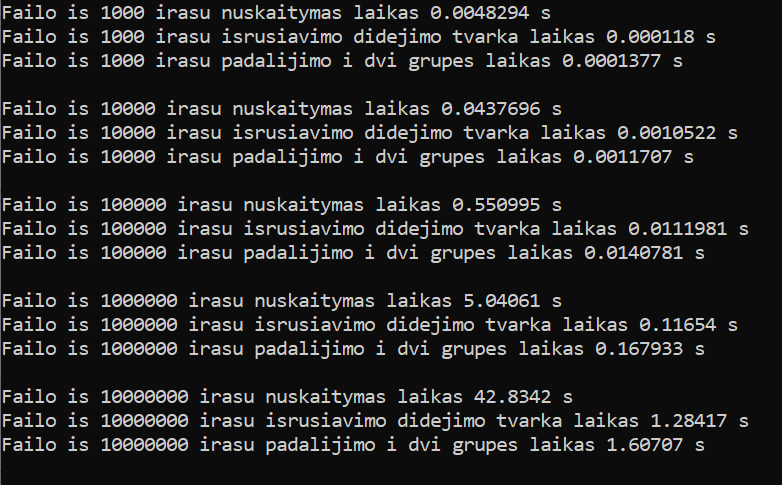
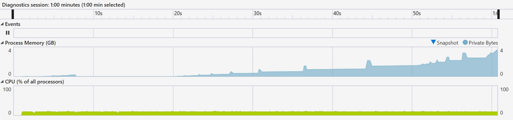
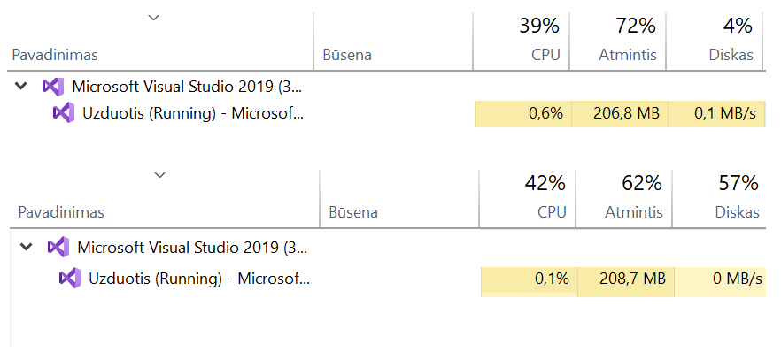
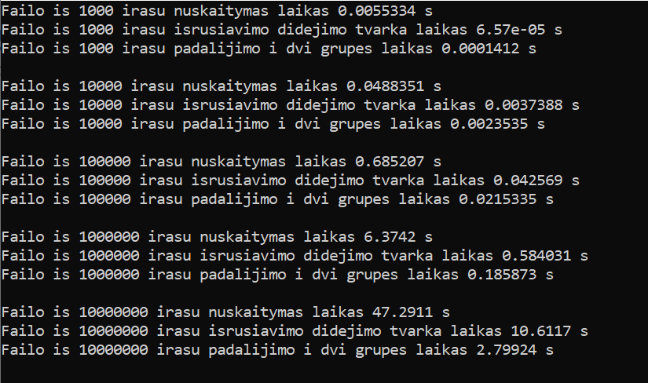
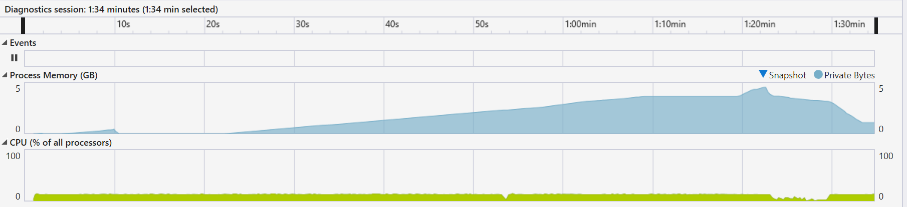
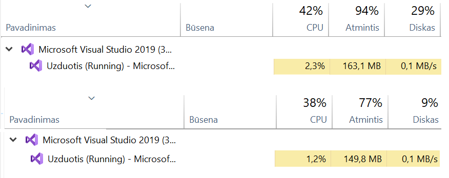

# Objektinis programavimas. Užduotis.

## v0.5: Konteinerių (std::vector ir std::list) testavimas: 

Atliekamas dviejų tipų konteinerių testavimas su 5 skirtingais failas:
- iš 1000 įrašų (stud1000.txt)
- iš 10000 įrašų (stud10000.txt)
- iš 100000 įrašų (stud100000.txt)
- iš 1000000 įrašų (stud1000000.txt)
- iš 10000000 įrašų (stud10000000.txt)

Matuojamas laikas, pateikiami testavimo sistemos paramterai, vykdant:
- Duomenų nuskaitymą iš failo
- Duomenų suskirstymą į 2 grupes

**Testo rezultatai, naudojant std:vector<> konteinerį:**

**Testo rezultatai, naudojant std:list<> konteinerį:**

**Išvados:**
- Programa, kurioje naudojami std::vector<> tipo konteineriai, veikia greičiau nuskaitant failus (matomas 5-7 sekundžių skirtumas);
- Programa, kurioje naudojami std::vector<> tipo konteineriai, vykdymo procese taip pat sunaudoja mažiau atminties (1 GB skirtumas);
