# Objektinis programavimas.

*Pastaba: visos nuotraukos, naudojamos šiame faile, yra repozitorijoje esančiame aplanke "images".*

## [v1.1] (https://github.com/UrteSataite/Uzduotis_Objektinis_2/releases/tag/v1.1)

*Nuo v1.1 vietoje Visual Studio pradėtas naudoti CodeBlocks.*

Programos spartos testai atliekami naudojant **std::vector konteinerį** ir **v1.0 versijoje realizuotą 2 strategiją**.

Prieš pakeičiant Studnetas struktūra į Studentas klasę, buvo atlikti pakeitimai v1.0 kode: prieš tai buvusios 2 atskiros Studentas ir Studentas_sort struktūros pertvarkytos į vieną Studentas struktūrą. Todėl iš naujo alikti programos veikimo sportos testai. **Gauti tokie rezultatai**:

 

**Programos veikimo spartos testo rezultatai, pakeitus struktūrą į klasę:**

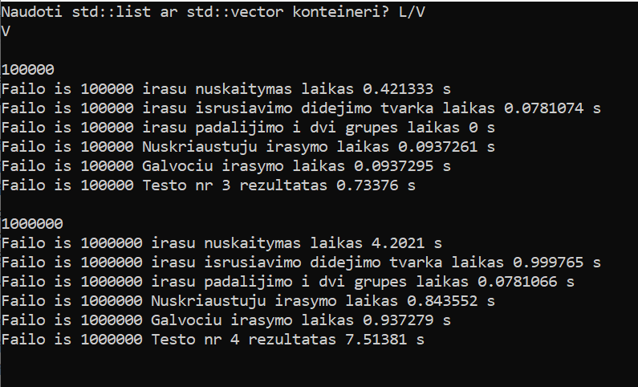 

Toliau matomi rezultatai, atlikus programos spartos testus, pakeitus kompiliatoriaus optimizavimo lygį, nurodomą per flag'us: O1, O2, O3:

**Naudojant O1 (Optimize more(for speed)):**

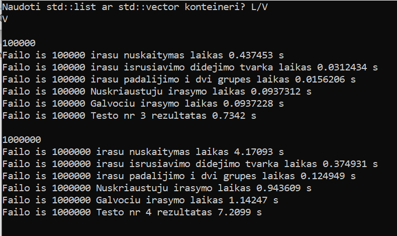 

**Naudojant O2 (Optimize even more (for speed))**

 

**Naudojant O3 (Optimize fully (for speed))**

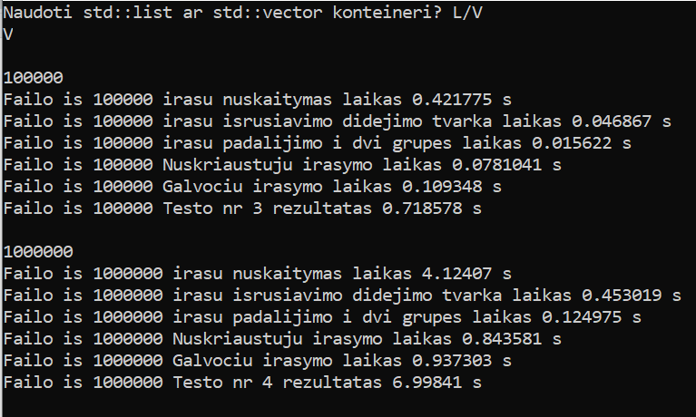 

**Išvados:**
- Greičiausiai nuskaitytas 100 tūkst. duomenų failas, naudojant O2 (O2 ir O3 skirtumas ~ 0.02s).
- Greičiausiai nuskaitytas 1 mln. duomenų failas, naudojant O3 (O3 ir O1 skirtumas ~ 0.05s).
- Failo iš 1 mln įrašų dalijimo trukmė labai panaši naudojant visus flag'us (skirtumas tarp O1 ir O3 vos 0.000026 s).
- Duomenų įrašymo į 2 failus: Nuskriaustieji.txt ir Galvociai.txt laikas greičiausias naudojant O3 flag'ą.
- Visas testas atliekamas greičiausiai naudojant O3 flag'ą.

## [v1.0] (https://github.com/UrteSataite/Uzduotis_Objektinis/releases/tag/v1.0) 

**Galutinės versijos veikimo principas:**
- Sugeneruojami 5 .txt failai, talpinantys studentų duomenis;
- Vartotojas tuomet gali pasirinkti, kurį konteinerio tipą naudoti;
- Studentai padalijami į dvi grupes jų pagal galutinį balą. Nauji sąrašai yra išvedami į atitinkamus .txt failus;
- Atliekami programos spartos testai kiekvienam failui. Testo rezultatus vartotojas mato ekrane;

#### Projekto stuktūra:
- Uzduotis.cpp (main cpp failas);
- Failų generavimui: failu_generavivmas.cpp, failu_generavimas.h;
- Darbui su std::vector tipo konteineriu: funkcijos_v.cpp, funkcijos_v.h, outputai_v.cpp, outputai_v.h, sturukturos_v.h;
- Darbui su std::list tipo konteineriu: funkcijos.cpp, funkcijos.h, outputai.cpp, outputai.h, sturukturos.h;

Patobulinta programa, vartotojas gali pasirinkti, kokį konteinerio tipą: std:vector ar std::list nori naudoti. Programa veikia sklandžiau, kodas atrodo švaresis. Taip pat į naują .cpp failą iškeltas failų generavimas. Dėl to pasikeičia projekto struktūra.
Optimizuota studentų dalijimo į dvi grupes realizacija pagal 2 strategiją: panaudojamas tik vienas naujas konteineris (tipas priklauso nuo vartotojo pasirinkimo), skirtas talpinti studentų, kurių galutinis balas < 5.0, duomenis. 
Atlikti programos spartos testai, skirti palyginti ne tik skirtingų konteinerių, bet ir skirtingų dalijimo į dvi grupes būtų veikimą. Testų rezultatai pateikiami nuotraukose. 

*Svarbu paminėti, jog didelio atminties sunaudojimo bandoma išvendti naudojant swap() funkciją. Be šios funkcijos iškyla problemų dėl atminties, kurių paprastas clear() nesutvarko.*

#### 1 strategija

Programos spartos testo rezultatai bei programos metu naudojamos atminties bei CPU rodmenys, naudojant **std::vector** tipo konteinerį.

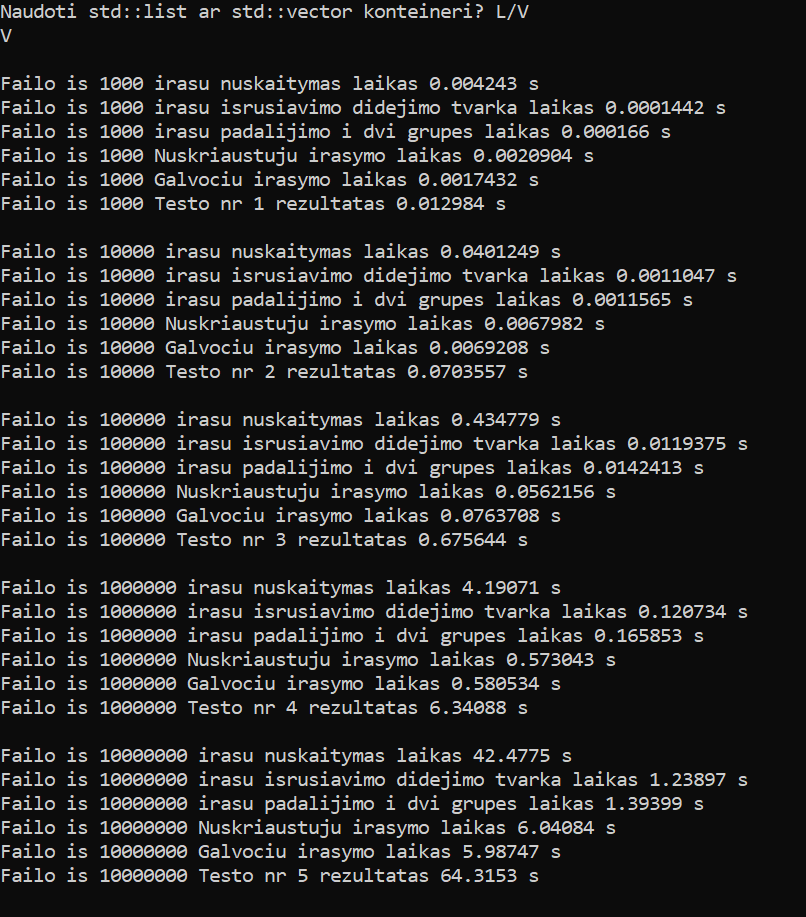 

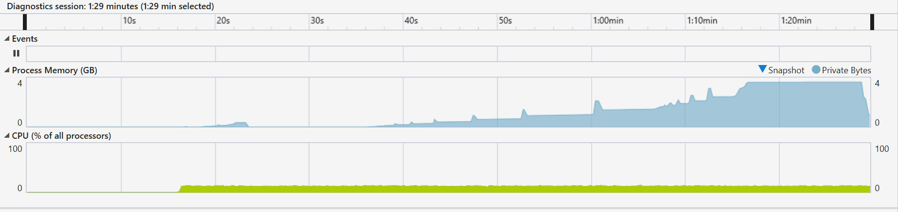

Programos spartos testo rezultatai bei programos metu naudojamos atminties bei CPU rodmenys, naudojant **std::list** tipo konteinerį.

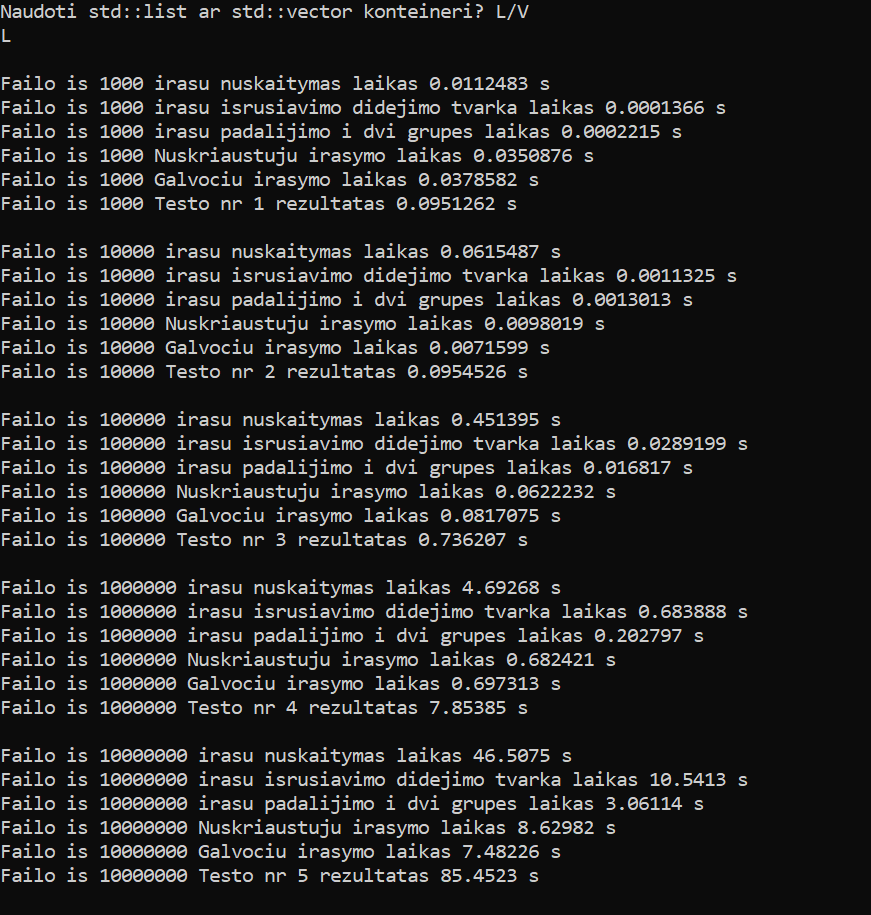 

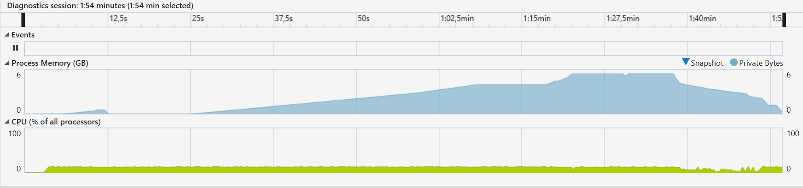

**1 strategijos išvados:**
- Šis realizavimo būdas užima daug atminties: naudojant std::vector užimama atmintis sieka 4 GB, tuo tarpu naudojant std::list, užimama atmintis sieka net 6 GB;
- Failo iš 10 milijonų įrašų padalijimas į dvi grupes, naudojant std::vector užtunka 1.39s, o std::list 3.06s;

#### 2 strategija

Programos spartos testo rezultatai bei programos metu naudojamos atminties bei CPU rodmenys, naudojant **std::vector** tipo konteinerį.

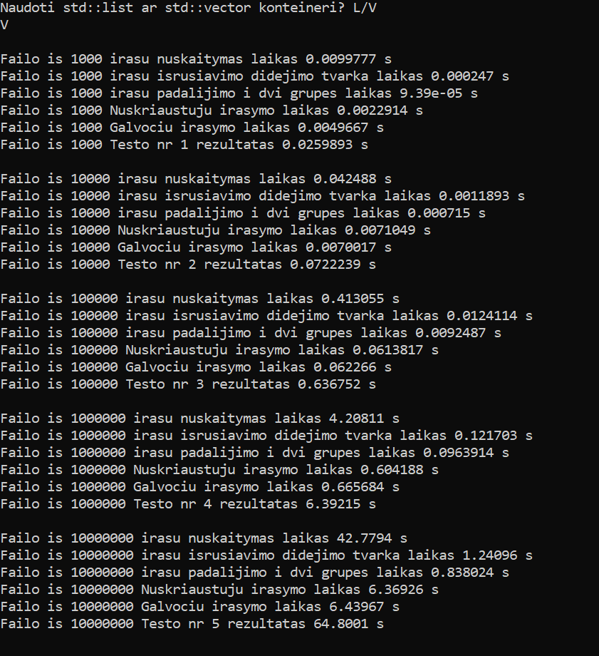 

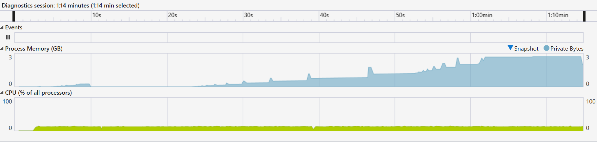

Programos spartos testo rezultatai bei programos metu naudojamos atminties bei CPU rodmenys, naudojant **std::list** tipo konteinerį.

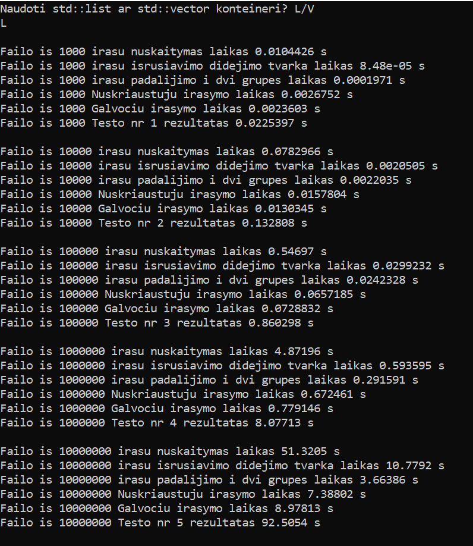 

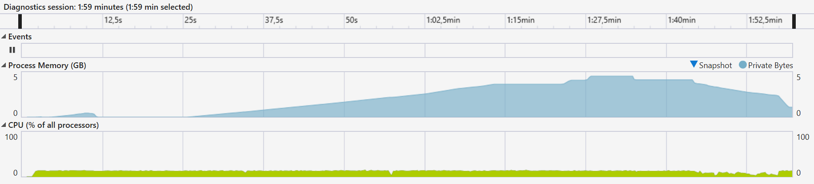

**2 strategijos išvados:**
- Šis realizavimo būdas yra kur kas efektyvesnis dėl atminties naudojimo: naudojant std::vector užimama atmintis siekia 3 GB, o naudojant std::list 5 GB, t.y. 1 GB mažiau, negu sunaudoja programa, atilikta pagal pirmąją strategiją;
- Naudojant std::vector, failo iš 10 milijonų įrašų padalijimas į dvi grupes užtrunka 0.84s, tuo tarpu naudojant std::list užtunka 3.66s;

## [v0.5] (https://github.com/UrteSataite/Uzduotis_Objektinis/releases/tag/v0.5) 

Atliekamas dviejų tipų konteinerių testavimas su 5 skirtingais failas:
- iš 1000 įrašų (stud1000.txt)
- iš 10000 įrašų (stud10000.txt)
- iš 100000 įrašų (stud100000.txt)
- iš 1000000 įrašų (stud1000000.txt)
- iš 10000000 įrašų (stud10000000.txt)

Matuojamas laikas, pateikiami testavimo sistemos paramterai, vykdant:
- Duomenų nuskaitymą iš failo
- Duomenų suskirstymą į 2 grupes

#### Testo rezultatai, naudojant std:vector<> konteinerį:

#### Testo rezultatai, naudojant std:list<> konteinerį:

#### Išvados:
- Programa, kurioje naudojami std::vector<> tipo konteineriai, veikia greičiau nuskaitant failus (matomas 5-7 sekundžių skirtumas);
- Programa, kurioje naudojami std::vector<> tipo konteineriai, vykdymo procese taip pat sunaudoja mažiau atminties (1 GB skirtumas);

## [v0.4] (https://github.com/UrteSataite/Uzduotis_Objektinis/releases/tag/v0.4) 

Sutvarkyta, patobulinta programa. Funkcijos iškeltos į kitus failus. 
Taip pat realizuojamas penkių skirtingų dydžių failų generavimas. 
Studentai išrūšiuojami į dvi grupes: kurių galutinis balas < 5.0 ir kurių galutinis balas >= 5.0. Tam sukuriamos 2 naujos struktūros.
Šių skirtingų grupių studentų duomenys išvedami į skirtingus .txt failus: "nuskriaustieji.txt" ir "galvociai.txt".
Atliktas programos spartos testas (releaso metu buvo nebaigtas). 

Testo rezultatai:

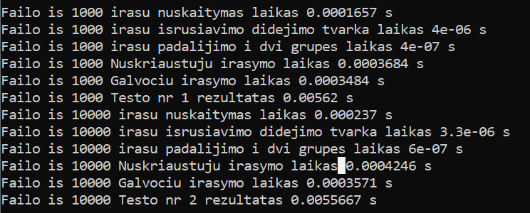

#### Projekto struktūra:
- funckijos.h
- outputai.h
- strukturos.h 
- funckijos.cpp
- outputai.cpp
- Uzduotis.cpp

## [v0.3] (https://github.com/UrteSataite/Uzduotis_Objektinis/releases/tag/v0.3)

Programoje naudojamos funkcijos, struktūros, bibliotekos bei naudojami aprašyti kintamieji iškelti į pagalbinius header failus. Taip pat programoje panaudotas išimčių valdymas (angl. Exception Handling).

#### Projekto struktūra:
- biblioteka.h
- skaiciavima.h
- spausdinimas.h
- strukturos.h
- Uzduotis.cpp

## [v0.2] (https://github.com/UrteSataite/Uzduotis_Objektinis/releases/tag/v0.2)

v.01 versija papildyta duomenų nuskaitymu iš .txt failo bei išvedimu į .txt failą. Duomenis pradedami talpinti į struktūras.

#### v0.2 veikimo principas:
- Vartotojas paklausiamas, ar nori įvesti duomenis, ar nuskaityti iš failo;
- Vartotojui pasirinkus duomenų nuskaitymą iš failo, rezultatai yra išvedami į failą, prieš tai jam pasirinkus, pagal ką rūšiuoti studentus: vardus ar pavardes;

#### Programoje realizuotos tos pačios 3 funkcijos, kaip ir v0.1.

## [v0.1] (https://github.com/UrteSataite/Uzduotis_Objektinis/releases/tag/v0.1)

#### v0.1 veikimo principas:
- Vartotojas įveda norimą studentų skaičių bei tų studentų duomenis: vardus, pavardes;
- Vartotojui pateikiama galimybė sugeneruoti tiek namų darbų rezultatus, tiek egzamino rezultatus;
- Vedami/generuojami balai tol, kol vartotojas nusprendžia sustoti;
- Vartotojas pasirenka, rodyti studentų pažymių medianas ar vidurkius;

#### Programoje realizuotos trys funckijos:
- Medianos skaičiavimas;
- Vidurkio skaičiavimas;
- Spausdinimas į ekraną;

Atskirame .cpp faile užduotis atlikta naujant C masyvą.
